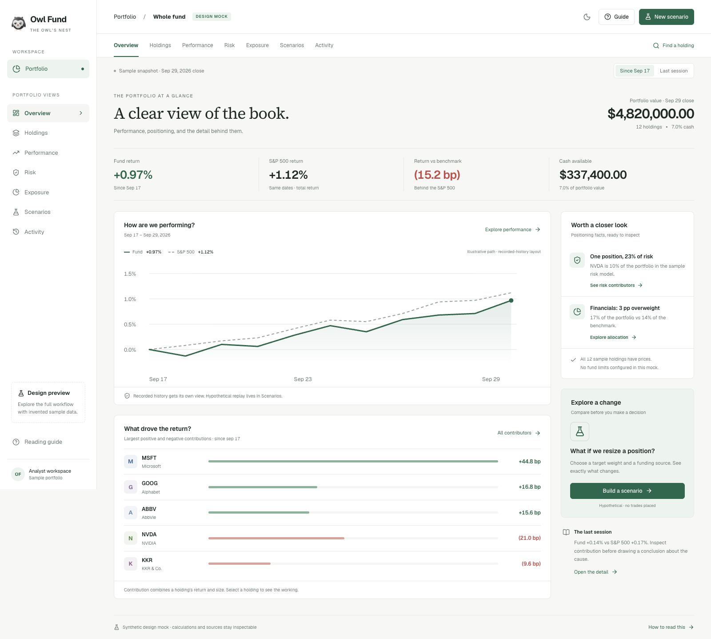
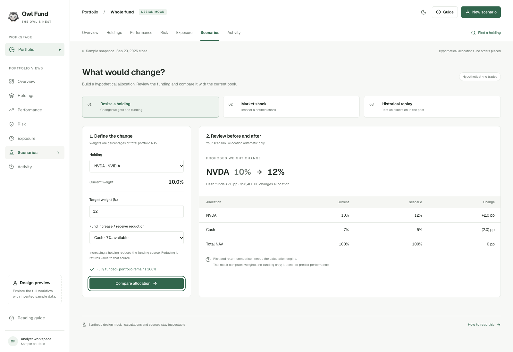
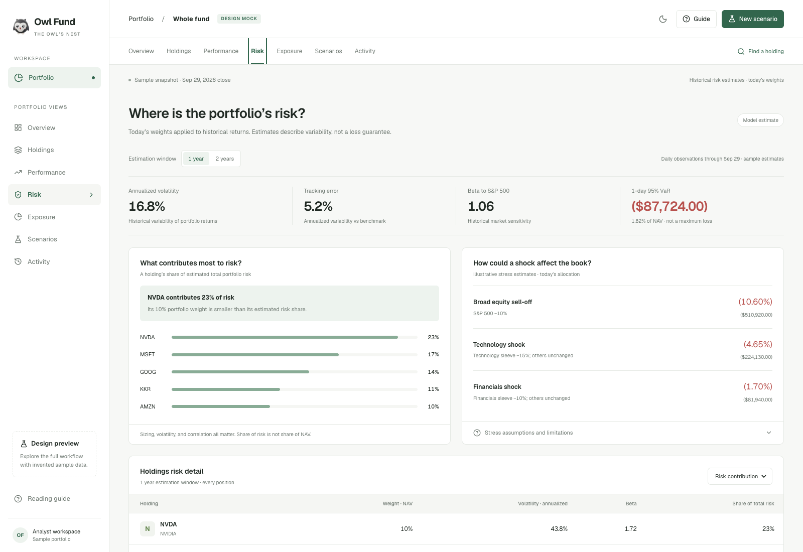
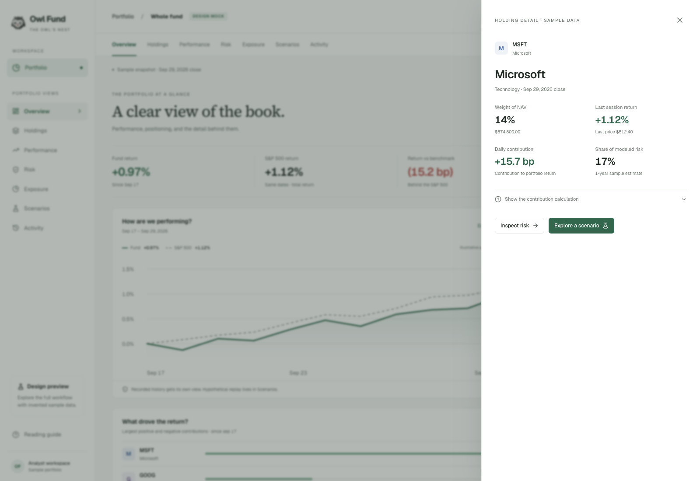

# Portfolio design mock

Open `/portfolio-mock` on this branch. Run `npm install` (or `npm ci`), then `npm run dev`; no credentials or feature flags are needed for this route. It is intentionally a public, synthetic review surface, excluded from search indexing. The exact-path proxy exception does not expose the authenticated portfolio or any API.

## Proposal

Move portfolio navigation above the summary. Add an Overview organized around performance, contribution, and positioning facts. Keep Holdings, Performance, Risk, Exposure, Scenarios, and Activity as separate destinations with one question each. Detail is available through full tables, expandable calculation notes, and a keyboard-accessible holding drawer.

The overview replaces the competing side panels with linked positioning facts and a scenario entry point. The full holdings table supports search, team filtering, sorting, extra columns, and CSV export. Performance preserves holding/team contribution and an attribution explanation. Risk includes contributions, volatility, beta, tracking error, VaR, stress examples, and expandable model/coverage detail. Exposure preserves sector comparisons and sector-to-holding drill-downs, with factor/ETF limitations stated. Activity supports entry filtering and expandable provenance. Light/dark themes and narrow-screen layouts are included.

Scenarios expose the funding source explicitly. Only allocation arithmetic is functional: validate the target, debit/credit cash or another holding, and preserve 100% of NAV. No trade is placed. Risk and future performance are not fabricated. The market-shock example is simple weight-times-shock arithmetic. Historical replay is a workflow proposal with visible assumptions; it does not run an engine or show invented replay results.

## Data and integration boundaries

All prices, holdings, returns, weights, risk statistics, and activity entries are invented fixtures. The sample activity is not a complete ledger. Return contributions are computed from sample fixed weights and holding returns; the chart paths and attribution split are illustrative. Risk values are fixtures, not covariance calculations; the two lookbacks demonstrate alternate states. No database, model provider, live market feed, authentication session, or production ledger is used by the mock components.

This is a reviewable design proposal, not a replacement for the live portfolio. Integration must retain existing NAV/ledger semantics, team authorization, benchmark return basis, data-quality states, attribution reconciliation, risk coverage and estimation, ETF constituent dates and residuals, replay assumptions/saved scenarios, and activity audit behavior.

## Review tasks

1. Find the largest detractor for each available performance period and inspect its calculation.
2. Search a holding, filter its team, reveal additional columns, and export the displayed rows.
3. Explain why share of risk differs from portfolio weight; inspect the model caveats.
4. Find a sector overweight and drill into its holdings.
5. Resize NVDA, fund it from cash or another holding, and verify the portfolio remains 100% allocated. Try an unfunded change.
6. Filter activity to dividends and expand an entry to identify its source.
7. Repeat on a phone-width viewport and navigate the drawers using the keyboard.

## Upstream review

Branch starts at `72d477a` on authoritative `origin/main` (September 30, 2026). Original divergence point is this branch creation commit. The original checkout is an older prototype with unrelated uncommitted work; none of that work is included or modified. Current main's shared PortfolioFrame, positions, performance, risk, exposure, backtesting, activity, root layout, and proxy were inspected. The mock adds a separate route and isolated styles; existing-code changes are the exact synthetic route bypass in the proxy and disabling version polling only while the reader is on this mock route. Any main commits arriving before push must be reviewed and integrated per the shared project instructions.

The one upstream commit arriving during this work, `b9c0154` (weekly-email SPXTR/SVX/SGX closes), was reviewed in full across all eight changed files and fast-forwarded into the working branch. Its provider, pure assembly, email output, and tests have no dependency on the isolated mock. The combined suite includes the new upstream tests. No feature was discarded or overridden.

## Verification

- Production build: `npm run build -- --webpack` passed, including TypeScript and static generation of `/portfolio-mock`.
- `npm run typecheck` and `npm run lint` passed; lint has no warnings.
- Full combined suite: 2,014 passing tests; one existing failure in `src/lib/sell-side/generate.test.ts:71` (`reasoning.effort` missing in a mocked provider request). That identical failure was reproduced from an untouched archive of authoritative main at `72d477a`. The subsequent upstream weekly-email commit did not change that code or test. No claim of an entirely green suite or merge readiness is made.
- Mock funding, authentication-boundary, and shared-format checks: seven tests passed. Coverage includes both funding sources, reduction proceeds, invalid/self-funded/unfunded allocations, and preserving authentication on live pages/APIs and similar mock paths.
- Browser: page loads without an error overlay or browser errors; holding search, team filters, extra columns, CSV export, risk windows, sector drill-downs, performance periods and team contributions, dividend filtering/expanded records, scenario validation and persistence, light/dark themes, and phone-width overflow were checked.
- Production preview: 390px mobile and 1600px desktop; native dialog opening focus and Escape dismissal checked. Final mobile navigation exposes all seven sections and chart labels remain readable.
- React review: components remain hoisted, derived values are computed without state effects, form fields are labeled, navigation declares the current page, native modal dialogs manage focus, and mock CSS is scoped to its surface.

## Screenshots

Overview:

Guided allocation comparison:

Risk:

Holding drill-down:

[Mobile overview](portfolio-mock/mobile.png)
